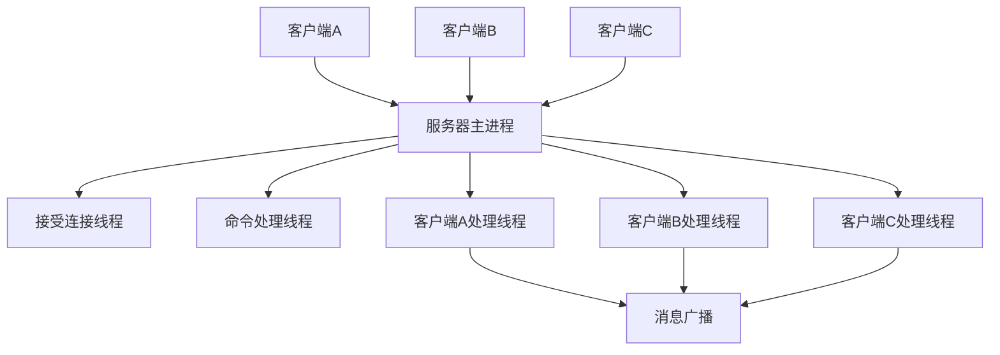
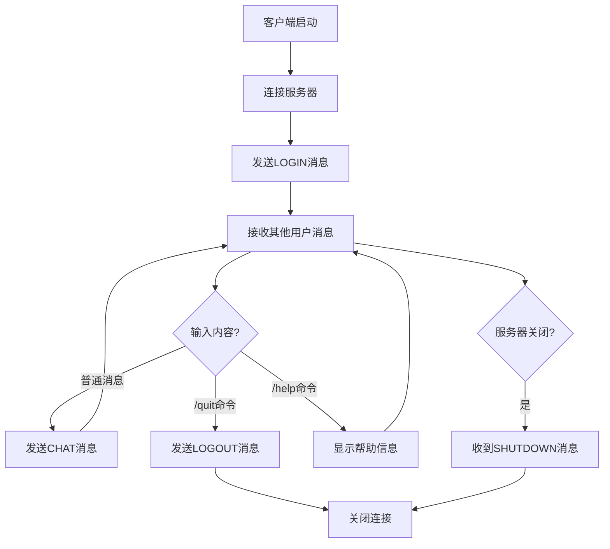

# 基于流式Socket的多人聊天程序设计与实现

## 实验报告

**姓名：** 周重天
**学号：** 2311082

---

## 1. 实验原理

### 1.1 TCP/IP协议基础

TCP（传输控制协议）是一种面向连接的、可靠的传输层协议。与UDP相比，TCP提供了数据包的可靠传输、顺序保证和连接管理功能。在聊天应用中，消息的完整性和顺序至关重要，因此选择TCP协议作为传输层协议。

### 1.2 客户端-服务器架构

本聊天系统采用经典的客户端-服务器（C/S）架构。服务器作为消息转发中心，负责接受多个客户端连接、维护用户状态、转发消息给相应的客户端。客户端负责用户交互、消息显示和与服务器通信。这种架构的优势在于集中式管理、易于维护、支持多用户并发。

### 1.3 Socket编程原理

Socket是操作系统提供的网络编程接口，它抽象了TCP/IP协议栈的复杂性。服务器端通过`socket()`创建监听套接字，使用`bind()`绑定地址和端口，通过`listen()`开始监听连接请求，使用`accept()`接受客户端连接。客户端通过`connect()`主动连接服务器。连接建立后，双方使用`send()`和`recv()`进行数据通信。

### 1.4 多线程并发处理

为支持多用户同时在线聊天，系统采用多线程架构。服务器为每个客户端连接创建独立的处理线程，避免了单线程模式下的阻塞问题。通过线程间的同步机制（互斥锁、原子操作），确保共享资源的安全访问和数据一致性。



## 2. 协议设计

### 2.1 协议设计思路

设计了一套自定义的应用层聊天协议，基于二进制格式传输以提高效率。协议支持多种消息类型，采用变长字段设计节省带宽，包含时间戳信息便于消息排序和显示。所有多字节数据采用网络字节序（大端序）传输，保证跨平台兼容性。

### 2.2 消息类型定义

协议定义了五种基本消息类型来满足聊天系统的各种需求：

```cpp
enum MessageType {
    MSG_LOGIN = 0x01,           // 用户登录消息
    MSG_LOGOUT = 0x02,          // 用户退出消息
    MSG_CHAT = 0x03,            // 聊天消息
    MSG_SERVER_SHUTDOWN = 0x04, // 服务器关闭消息
    MSG_USER_LIST = 0x05        // 用户列表消息（预留扩展）
};
```

MSG_LOGIN用于用户加入聊天室时的通知，MSG_LOGOUT处理用户退出情况，MSG_CHAT承载实际的聊天内容，MSG_SERVER_SHUTDOWN确保服务器优雅关闭时通知所有客户端，MSG_USER_LIST为将来功能扩展预留。

### 2.3 消息格式设计

每个消息包含固定头部和可变消息体，总体格式如下：

```
[消息类型(1字节)] [用户名长度(1字节)] [用户名(变长)] [消息长度(2字节)] [消息内容(变长)] [时间戳(8字节)]
```

消息类型字段标识当前消息的用途。用户名长度字段记录后续用户名的实际字节数，支持1-31字节的用户名。用户名字段使用UTF-8编码，支持中英文混合。消息长度字段采用2字节网络字节序，支持最大1023字节的消息内容。消息内容同样使用UTF-8编码。时间戳字段使用8字节Unix时间戳，精确记录消息发送时间。

### 2.4 协议工作流程

整个聊天过程遵循严格的协议流程：客户端连接服务器后立即发送MSG_LOGIN消息，服务器记录用户信息并向其他客户端广播用户加入通知。正常聊天过程中，客户端发送MSG_CHAT消息，服务器接收后转发给除发送者外的所有客户端。用户退出时发送MSG_LOGOUT消息或由服务器检测连接断开后生成退出通知。服务器关闭时向所有客户端广播MSG_SERVER_SHUTDOWN消息。



## 3. 具体实现

### 3.1 系统架构设计

系统采用模块化设计，分为三个核心模块。协议处理模块（protocol.h）提供消息结构定义、序列化反序列化功能和时间戳处理。服务器模块（server.cpp）实现多线程服务器，负责客户端连接管理、消息转发和在线用户维护。客户端模块（client.cpp）提供用户界面、消息收发和命令处理功能。

### 3.2 关键数据结构

协议处理模块定义了核心消息结构：

```cpp
struct ChatMessage {
    unsigned char type;                  // 消息类型
    unsigned char username_len;          // 用户名长度
    char username[MAX_USERNAME_LEN];     // 用户名
    unsigned short message_len;          // 消息长度
    char message[MAX_MESSAGE_LEN];       // 消息内容
    unsigned long long timestamp;        // 时间戳
};
```

服务器维护客户端信息结构：

```cpp
struct ClientInfo {
    SOCKET socket;           // 客户端套接字
    std::string username;    // 用户名
    bool active;            // 活跃状态标志
};
```

### 3.3 消息序列化与反序列化

序列化过程将结构化的消息转换为网络传输的字节流。关键在于处理网络字节序转换，确保跨平台兼容性：

```cpp
// 消息长度转换为网络字节序
buffer[offset++] = (msg.message_len >> 8) & 0xFF;  // 高字节
buffer[offset++] = msg.message_len & 0xFF;         // 低字节

// 时间戳转换（8字节）
for (int i = 7; i >= 0; i--) {
    buffer[offset++] = (msg.timestamp >> (i * 8)) & 0xFF;
}
```

反序列化过程相反，将网络字节流还原为结构化消息，同时进行必要的边界检查和数据验证。

### 3.4 多线程同步机制

服务器使用互斥锁保护共享的客户端列表：

```cpp
std::mutex clients_mutex;
std::vector<ClientInfo*> clients;

// 广播消息时加锁保护
std::lock_guard<std::mutex> lock(clients_mutex);
```

客户端使用原子变量控制运行状态，避免竞态条件：

```cpp
std::atomic<bool> client_running(true);
```

### 3.5 中文字符支持

通过设置控制台编码页支持UTF-8字符集：

```cpp
#ifdef _WIN32
    system("chcp 65001 > nul");  // Windows UTF-8编码
#endif
```

协议层面使用UTF-8编码传输，确保中英文字符的正确显示和传输。

## 4. 代码讲解

### 4.1 服务器核心逻辑

服务器主函数首先初始化网络环境，创建监听套接字并绑定到8888端口。启动接受连接线程负责处理新的客户端连接，为每个连接创建独立的客户端处理线程。主线程进入命令处理循环，等待管理员输入quit命令关闭服务器。

```cpp
// 服务器主要工作流程
void accept_clients(SOCKET listen_socket) {
    while (server_running) {
        SOCKET client_socket = accept(listen_socket, ...);
        ClientInfo* client = new ClientInfo(client_socket);
        clients.push_back(client);
        std::thread client_thread(handle_client, client);
        client_thread.detach();  // 分离线程独立运行
    }
}
```

客户端处理线程循环接收消息，根据消息类型进行相应处理。LOGIN消息记录用户信息并广播，LOGOUT消息清理连接并通知其他用户，CHAT消息转发给所有其他客户端。

### 4.2 客户端实现要点

客户端主线程负责用户输入处理，区分命令和普通聊天内容。接收线程持续监听服务器消息，根据消息类型进行不同的显示处理。特别地，自己发送的消息显示为"[我]"，其他用户的消息显示实际用户名，系统消息使用"[系统]"前缀。

```cpp
// 客户端消息显示逻辑
std::string display_name = (sender == username) ? "我" : sender;
std::cout << "[" << time_str << "] [" << display_name << "] " << message << std::endl;
```

### 4.3 错误处理策略

程序实现了完善的错误处理机制。连接断开检测通过recv返回值判断，返回0表示正常关闭，小于0表示网络错误。数据包完整性通过反序列化时的边界检查保证，防止恶意构造的数据包。资源清理确保程序退出时正确关闭所有套接字和线程。

## 5. 效果展示

### 5.1 编译和启动

使用以下命令编译程序：

```bash
g++ -std=c++11 -o server.exe server.cpp -lws2_32 -pthread
g++ -std=c++11 -o client.exe client.cpp -lws2_32 -pthread
```

首先启动服务器：


### 5.2 多用户聊天演示

启动多个客户端，演示多用户实时聊天：


### 5.3 中英文混合聊天

展示UTF-8编码对中英文字符的支持：


### 5.4 用户进入退出通知

演示用户加入和离开的系统通知：


## 7. 实验总结

​	本次实验成功实现了基于TCP Socket的多人聊天系统，深入掌握了网络编程的核心技术。通过自定义二进制协议的设计，理解了应用层协议的工作原理和设计方法。多线程架构的实现锻炼了并发编程能力，学会了使用互斥锁、原子操作等同步机制。跨平台兼容性设计培养了系统性思维。

​	当前实现还有进一步优化的空间。使用I/O多路复用技术可以提高大规模并发性能，避免每客户端一线程的资源开销。增加数据库支持可以实现消息持久化和用户认证功能。添加TLS/SSL加密可以保护通信安全。开发图形用户界面可以提升用户体验。

​	通过本次实验，不仅掌握了Socket编程和协议设计的技术知识，更重要的是培养了解决复杂网络应用问题的系统性思维和工程实践能力。